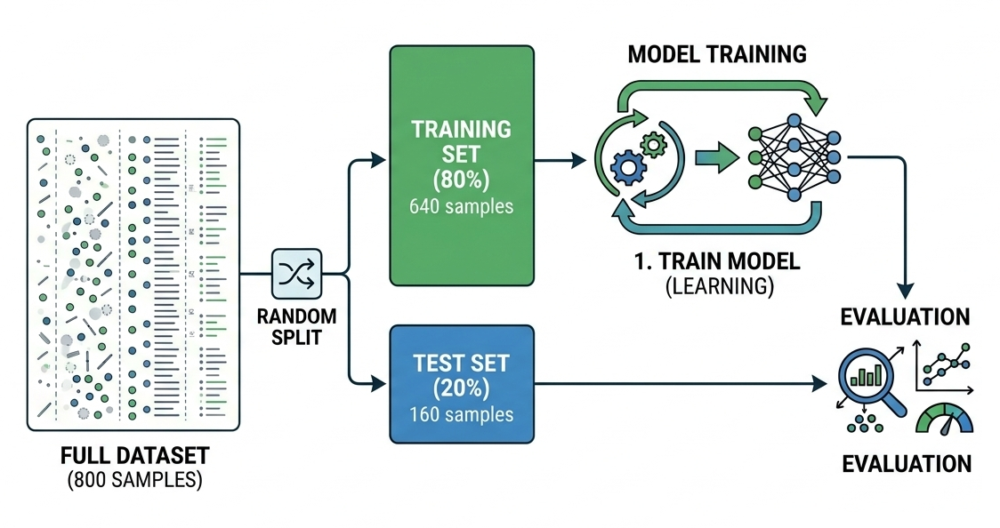

```{python}
#| echo: false
import warnings
warnings.filterwarnings("ignore")
```


### Datasets

A **dataset** is a structured collection of examples. Each row is one **instance**
(also called a sample or observation).

::: {.callout-note collapse="true"}
# The Iris dataset

{width=70%}

The Iris dataset, introduced by British statistician and biologist Ronald A. Fisher in 1936, is one of the most iconic datasets in the history of machine learning and statistics. It contains measurements of 150 iris flowers, evenly split across three species — Iris setosa, Iris versicolor, and Iris virginica — with each flower described by four features: sepal length, sepal width, petal length, and petal width, all measured in centimetres. Its appeal lies in its simplicity and structure: one class (setosa) is linearly separable from the other two, while the remaining pair overlaps slightly, making it an ideal sandbox for exploring both simple and more nuanced classification algorithms. 
:::


```{python}
#| fig-cap: "The first few rows of the Iris dataset."
#| code-fold: true

import pandas as pd
from sklearn.datasets import load_iris
import matplotlib.pyplot as plt

iris = load_iris(as_frame=True)
df = iris.frame
df["species"] = df["target"].map({0: "setosa", 1: "versicolor", 2: "virginica"})
df = df.drop(columns=["target"])

df.head(6)
```

### Features and Labels

**Features ($X$):** The input variables, characteristics, or attributes we use to make predictions.


**Labels ($y$):** The target variable we want the model to predict.

| Term | Meaning | Example (Iris) |
|------|---------|----------------|
| **Feature** | An input variable used to make predictions | petal length, sepal width |
| **Label** | The output the model tries to predict | species name |
| **Instance** | One row — one complete example | a single flower measurement |

```{python}
#| code-fold: true
#| fig-cap: "Two features coloured by label (species)"

colours = {"setosa": "#4C72B0", "versicolor": "#55A868", "virginica": "#C44E52"}

fig, ax = plt.subplots(figsize=(7, 4))
for species, group in df.groupby("species"):
    ax.scatter(group["petal length (cm)"], group["petal width (cm)"],
               label=species, color=colours[species], alpha=0.8,
               edgecolors="white", s=60)
ax.set_xlabel("Petal length (cm)  ← feature")
ax.set_ylabel("Petal width (cm)   ← feature")
ax.set_title("Iris dataset — features coloured by label")
ax.legend(title="Label (species)")
plt.tight_layout()
plt.show()
```


### Training vs. Testing

We split data into two sets:

- **Training set** — the model *sees* this and learns from it  
- **Test set** — *never seen* during training; used to estimate real-world performance  




```{python}
#| code-fold: true
#| fig-cap: "An 80/20 train/test split on the Iris dataset"

from sklearn.model_selection import train_test_split

X = df[["petal length (cm)", "petal width (cm)"]]
y = df["species"]
X_train, X_test, y_train, y_test = train_test_split(
    X, y, test_size=0.2, random_state=42
)

print(f"Training samples : {len(X_train)}  ({len(X_train)/len(df):.0%})")
print(f"Test samples     : {len(X_test)}  ({len(X_test)/len(df):.0%})")

fig, axes = plt.subplots(1, 2, figsize=(10, 4), sharey=True)
for ax, (split_X, split_y, title) in zip(axes, [
    (X_train, y_train, f"Training set  (n={len(X_train)})"),
    (X_test,  y_test,  f"Test set  (n={len(X_test)})")
]):
    for species, colour in colours.items():
        mask = split_y == species
        ax.scatter(split_X.loc[mask, "petal length (cm)"],
                   split_X.loc[mask, "petal width (cm)"],
                   label=species, color=colour, alpha=0.8,
                   edgecolors="white", s=60)
    ax.set_title(title)
    ax.set_xlabel("Petal length (cm)")
axes[0].set_ylabel("Petal width (cm)")
axes[1].legend(title="Species")
plt.tight_layout()
plt.show()
```

::: {.callout-warning}
**Data leakage** — accidentally letting the model see test data during training —
is one of the most common ML mistakes. It produces falsely optimistic performance estimates.
:::


