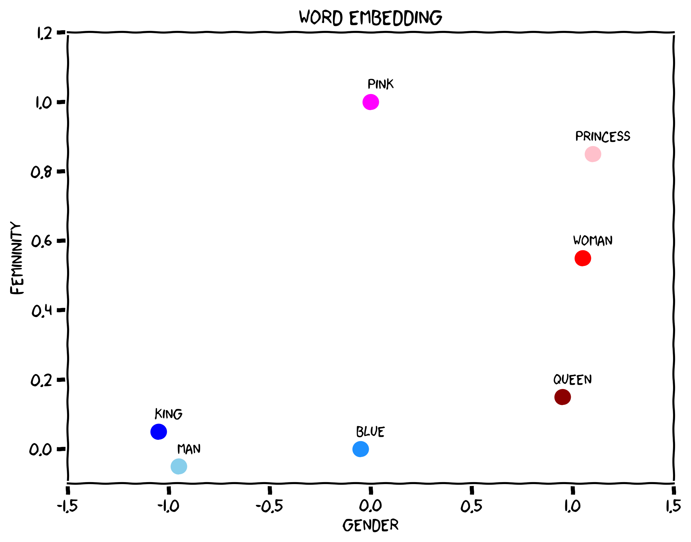
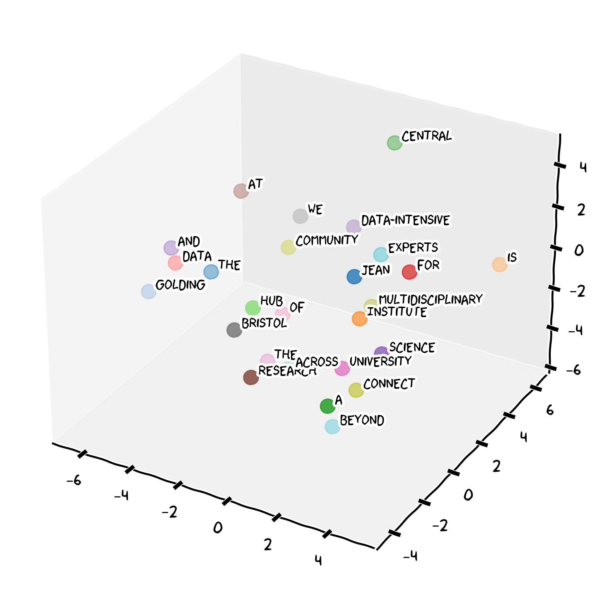

### Natural Language Processing

Natural Language Processing (NLP) is a branch of Artificial Intelligence that serves as the foundational technology that enables Large Language Models to understand and generate human language. Natural language is inherently ambiguous and contextual.

Consider the sentence

::: {.center}
**"I saw the man with the telescope"**.
:::

This could mean:

- you used a telescope to see the man,
- or you saw a man carrying a telescope. 

At its core, NLP transforms words, phrases, and sentences into numerical representations called embeddings — high-dimensional vectors that capture semantic meaning and relationships between linguistic elements. Words with similar meanings end up close together in this space. This mathematical representation of language allows to perform some complex reasoning about text by manipulating these vectors through neural network operations.

{width=90%}

### The Large Language Model Revolution

Large Language Models represented a paradigm shift in learning language patterns from the Internet, books, and other vast text sources. Built on [transformer architecture](https://en.wikipedia.org/wiki/Transformer_(deep_learning_architecture)), LLMs focus on relevant parts of the input when processing words (tokens) or phrases, enabling understanding of long-range dependencies that earlier models missed. While you don't need to understand the mathematics, the key insight is that LLMs work by finding patterns and relationships between concepts.

Let's assume that we have this sentence:

> The Jean Golding Institute is a central hub for data science and data-intensive research at the University of Bristol. We connect a multidisciplinary community of experts across the University and beyond.

Our *chatbot* will break the sentence in tokens of one or less words and assign each a numeric identifier. Then each of these tokens will have a mapping in the embedding space of our LLM model. 

{width=80%}

What makes LLMs "large" is their training scale, the exposure to hundreds of billions of words from diverse sources allows them to internalize grammar, vocabulary, world knowledge, and reasoning patterns. The training process is elegantly simple: given the sentence *"Photosynthesis converts light energy into..."*, the model has learned that "chemical energy" or "glucose" are far more likely completions than "jazz music."

### What Can LLMs Do?

LLMs are useful for a wide range of tasks relevant to your biology studies:

| Task | Example |
|------|---------|
| **Summarisation** | "Summarise the key findings of this paper on CRISPR-Cas9" |
| **Explanation** | "Explain the lac operon to a first-year student" |
| **Writing assistance** | "Help me improve the clarity of my lab report introduction" |
| **Brainstorming** | "What are possible confounding variables in my experiment?" |
| **Code help** | "Help me write an R script to plot my species abundance data" |

::: {.callout-important}
## Good Practice

AI should **enhance** your thinking, not replace it:

✅ "Help me identify gaps in my argument about natural selection"  
✅ "Suggest ways to improve the structure of this paragraph I wrote"  
✅ "What statistical test should I consider for this dataset, and why?"

❌ Asking AI to write your essay and submitting it as your own work

Read more about the [University guidance on Generative AI in Education](https://www.bristol.ac.uk/bilt/sharing-practice/guides/guidance-on-ai/).
:::

### Limitations You Must Know

#### Hallucinations

LLMs can generate text that is **plausible-sounding but factually wrong**. This is called hallucination. A model might confidently cite a paper that does not exist, state an incorrect enzyme name, or invent a study result. In biology, where precision matters, this is a serious risk.

#### Bias

LLMs are trained on text written by humans — which reflects human biases. Scientific literature, for instance, has historically over-represented research from Western, high-income countries. An LLM may therefore reflect these blind spots in what it treats as "typical" or "normal."

#### Subtle Errors

Beyond outright hallucinations, LLMs can make errors that are hard to spot without domain knowledge — misattributing a mechanism to the wrong organism, confusing similar gene names, or describing an outdated consensus.

::: {.callout-tip icon=false}
## Exercise: Spotting LLM Limitations

**Scenario**: You are writing a lab report on enzyme activity and ask an LLM the following:

> "Write 2 sentences about how temperature affects enzyme activity."

Review these three outputs and answer the questions below:

---

**Output A**: *"Enzyme activity increases with temperature up to an optimum, after which the enzyme denatures and activity falls sharply. For most human enzymes, this optimum is around 37°C, though thermophilic bacteria have enzymes that function optimally at temperatures exceeding 70°C."*

---

**Output B**: *"Temperature always increases enzyme activity by exactly 12.4% per degree Celsius. Above 40°C, all enzymes are immediately and permanently destroyed within 0.3 seconds."*

---

**Output C**: *"Higher temperatures generally increase the rate of enzyme-catalysed reactions by providing more kinetic energy, but excessive heat disrupts the enzyme's three-dimensional shape. The exact optimum temperature varies between organisms and enzyme types."*

**Questions**:

1. Which output is most reliable? What makes it trustworthy?
2. What specific red flags can you identify in Output B?
3. Is Output A entirely reliable? What would you want to verify?
4. How would you check the information before including it in a lab report?
:::

::: {.callout-warning icon=false collapse="true"}
## Suggested Answers

**Output C** is the most reliable. It makes appropriately general claims, acknowledges variation ("varies between organisms"), and does not invent precise figures.

**Output B** contains clear hallucinations:
- "exactly 12.4% per degree" — real biology does not work with such suspiciously precise universal rules
- "immediately and permanently destroyed within 0.3 seconds" — extreme and unverifiable claim
- "all enzymes" — overly absolute; real biology is full of exceptions

**Output A** is plausible but still requires verification:
- "around 37°C" is a reasonable figure for many *human* enzymes but should not be generalised
- The thermophile claim is broadly correct but the specific threshold (70°C) should be checked
- Always verify specific numbers against a textbook or primary source

**Verification strategies**: Cross-reference with your lecture notes, a trusted textbook (e.g., Alberts' *Molecular Biology of the Cell*), or a peer-reviewed review article.
:::
