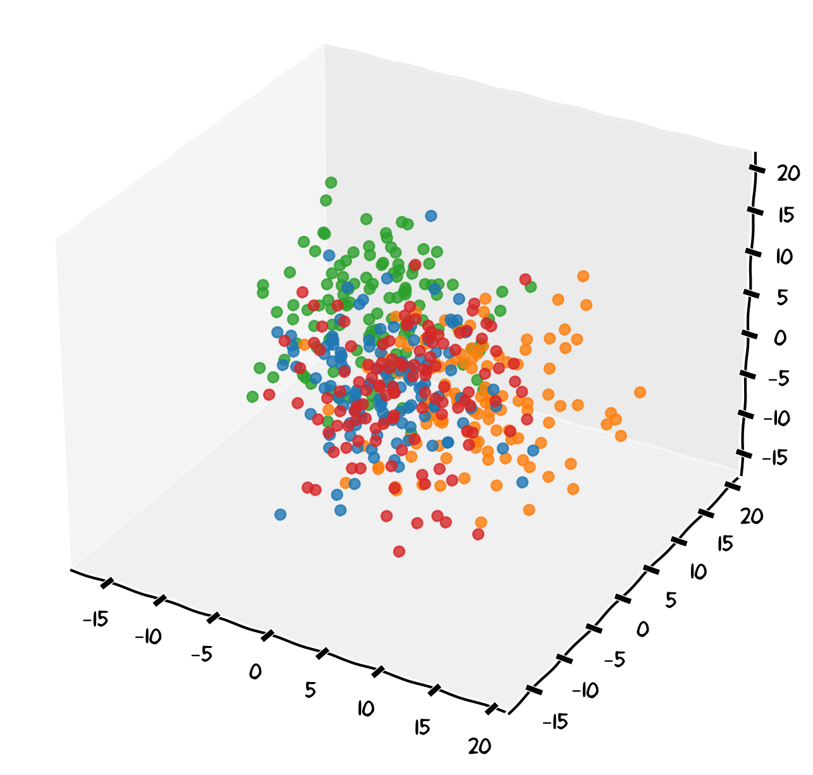

Large Language Models work by navigating through vast embedding spaces—multidimensional representations of knowledge and concepts. Vague or poorly defined **context** can lead the model to explore irrelevant areas of this space, producing generic or off-target responses. 

A vague prompt like "explain genetics" leaves the model free to wander anywhere in that space — introductory school content, clinical genetics, molecular detail, philosophy of inheritance. Precise context acts as a compass, directing the model toward exactly the part of that space that is relevant to *you*.

{width=80%}

:::{callout-note}
### Why Context Is So Important

When you send a message to an LLM, it has **no idea who you are or what you need** unless you tell it. It has no memory of previous sessions, no access to your course notes, and no knowledge of your assignment brief. It will fill these gaps with assumptions — and those assumptions may be completely wrong for your situation.
:::

### Types of Context

#### Explicit Context

This is information you directly state in your prompt:

- **Your role**: "I am a second-year biology undergraduate..."
- **The task**: "...writing a 1,500-word essay..."
- **The audience**: "...for a non-specialist reader..."
- **The requirements**: "...focusing on three examples of convergent evolution."

#### Implicit Context

These are assumptions the LLM makes when you don't specify something. For example, if you don't mention your level, it may assume you are an expert (and use jargon) or a complete beginner (and oversimplify). Making implicit context explicit is one of the simplest ways to improve AI outputs.

### Writing Better Prompts: Before and After

Here is an example of how context transforms the quality of an AI response:

::: {.panel-tabset}

### ❌ Vague Prompt

> Write about the immune system.

This will likely produce a generic textbook overview covering everything from innate immunity to antibodies — possibly too basic, too advanced, or simply not what you needed.

### ✅ Contextualised Prompt

> I am a second-year biology undergraduate at the University of Bristol preparing for an end-of-term exam. Explain the difference between the innate and adaptive immune response in around 200 words, at a level appropriate for someone who has completed one year of cell biology. Use concrete examples where helpful.

This prompt gives the model your **role**, **task**, **length**, **level**, and **style preferences** — dramatically narrowing the space of possible responses to something useful.

:::

### Iterative Prompting

You rarely need to write the perfect prompt first time. A practical workflow is:

1. **Start with a basic request** — get an initial output
2. **Review the output** — what is missing, wrong, or off-target?
3. **Refine your prompt** — add specific details or correct misunderstandings
4. **Repeat** — until the output meets your needs

This is especially useful for longer tasks like essay planning, where you can build context across a conversation.

:::{.callout-tip icon=false}
## Exercise: Writing a Contextualised Prompt

**Scenario**: You need to prepare a short summary of a topic for a study group session.

**Starting prompt**:

> Summarise cell signalling.

**Your task**: Rewrite this prompt with full context to get a response that is actually useful for your situation. Consider including:

- Who you are and what course/year you are in
- The purpose of the summary (study group, exam prep, essay planning, etc.)
- Your audience (peers at the same level as you)
- The desired length and format
- Any specific aspect of cell signalling you want covered

Then, if you have access to an AI tool, try both the vague and contextualised prompts and compare the outputs.
:::

::: {.callout-warning collapse="true"}
## Example Contextualised Prompt

> I am a second-year biology undergraduate at the University of Bristol. I am preparing a 5-minute verbal summary of cell signalling for a peer study group — everyone in the group has completed the same lectures I have, so I don't need basic definitions. Focus on the key differences between receptor tyrosine kinase and G-protein coupled receptor pathways, with one biological example for each. Keep the summary concise and clear enough to explain aloud without notes.

Notice how this prompt specifies: role, purpose, audience level, topic focus, examples, length, and format.
:::
